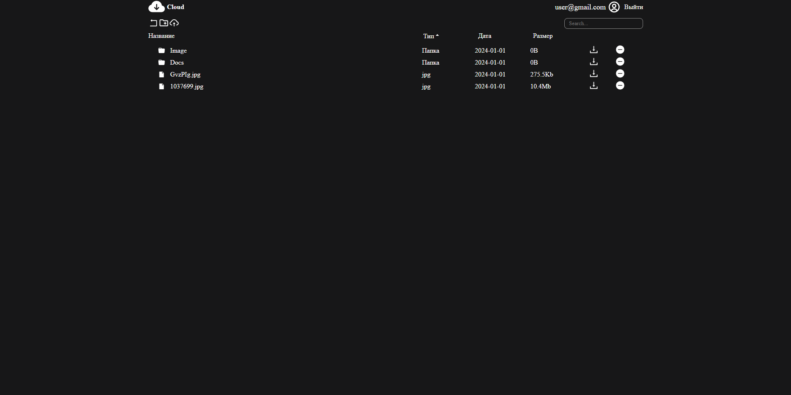

# Cloud

A platform for storing files and securely providing access to them.

#### Main page:



## Installation Guide

### Requirements

- [Nodejs](https://nodejs.org/en/download)
- [PostgreSQL](https://www.postgresql.org/download/)

Both should be installed and make sure postgreSQL is running.

```shell
git clone https://github.com/xkz1899/cloud.git
cd cloud
```

Install the dependencies.

```shell
cd server
npm install
cd ../client
npm install
cd ..
```

#### Create a database named "cloud" in the database postgreSQL.

### Database structure:

#### Table name "files":

| name       | type    |
| ---------- | ------- |
| id         | integer |
| name       | text    |
| type       | text    |
| accesslink | text    |
| size       | bigint  |
| path       | text    |
| user_id    | integer |
| parent_id  | integer |
| date       | date    |

#### Table name "users":

| name       | type    |
| ---------- | ------- |
| id         | integer |
| email      | text    |
| password   | text    |
| avatar     | text    |
| role       | text    |
| disk_space | bigint  |
| used_space | bigint  |

#### Table name "tokens":

| name          | type    |
| ------------- | ------- |
| id            | integer |
| user_id       | integer |
| refresh_token | text    |

#### Start server.

```shell
cd server
npm start
```

#### Start client.

```shell
cd client
npm start
```

Now open http://localhost:3000 in your browser.
